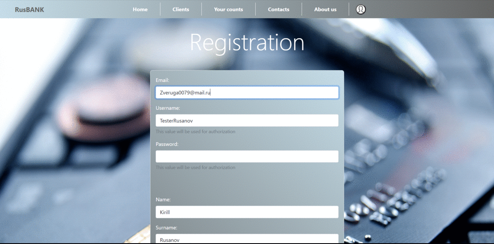
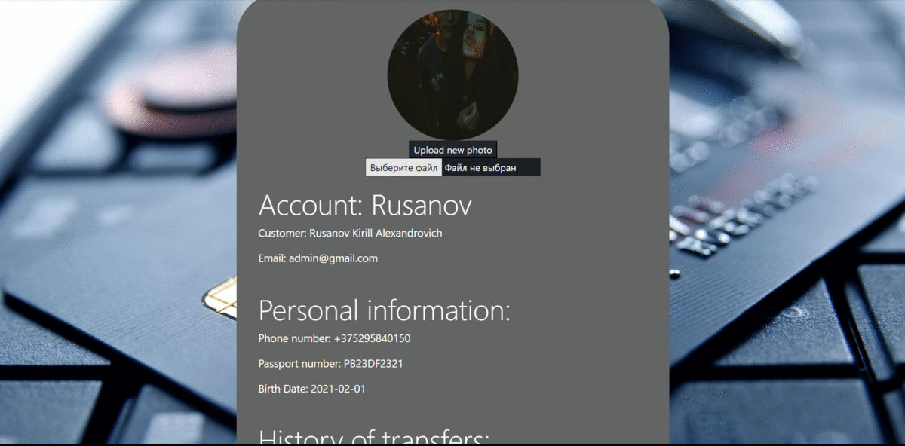

<h1 align="center">WebBankSystem 💰</h1>

The banking system provides an interface for managing a bank 
account when there is no need to go to the bank to perform 
operations: paying an invoice, withdrawing cash, transfers, etc.

There is an access control system. To have access, 
you need to register / authorize / stages of verification. 
The user is given the opportunity to view the profile,
where it is possible to install a photo and see the translation history.
There is a system for managing accounts and cards .

**REGISTRATION**

**VERIFICATION AFTER REGISTRATION**

**AUTHORIZATION**

**SETTING A PROFILE PHOTO**

**COUNT & CARD MANAGEMENT**

<h2 align="center">Skills used in development: </h2>

  🗹 CSS / JSP / Hibernate / Liquibase 
  🗹 MySql / Spring Framework / JavaxMail / Bootstrap 
  🗹 Spring Boot / Maven / Tomcat / JWT Tokens 

 

 > develop - Development branch 
 > spring boot - Mirror version of the project on Spring Boot

